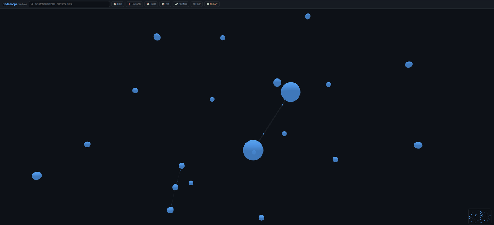

<div align="center">

# Codescope

**The brain your AI coding assistant is missing.**

Most AI code tools embed your code as vectors and hope nearest-neighbor finds the
right answer. Codescope builds an actual **knowledge graph** — entities, calls,
imports, type hierarchies — so AI agents can *traverse* your code instead of guessing.

Rust-native, fully local, 52 MCP tools, 57 supported formats, 99%+ token savings.

[Install](#install) · [How It Works](#how-it-works) · [Tools](#tools) · [Benchmarks](BENCHMARKS.md) · [Contributing](CONTRIBUTING.md)


</div>

---

## Why?

AI coding assistants burn **148,000 tokens** reading files to find a function and its callers.

Codescope does it in **542 tokens**. Same answer. **99.6% cheaper.**

| Question | Traditional | Codescope | Saving |
|----------|:----------:|:---------:|:------:|
| Find function + callers | 148K tokens | 542 tokens | **99.6%** |
| List all structs | 1.4M tokens | 1.2K tokens | **99.9%** |
| Impact of changing X? | 142K tokens | 278 tokens | **99.8%** |
| Largest functions | 454K tokens | 289 tokens | **99.9%** |

> *Benchmarked on 7 projects across 5 languages. See [BENCHMARKS.md](BENCHMARKS.md).*

---

## Install

**One command. No dependencies.**

```bash
# Linux / macOS
curl -fsSL https://raw.githubusercontent.com/onur-gokyildiz-bhi/codescope/main/install.sh | bash

# Windows (PowerShell)
irm https://raw.githubusercontent.com/onur-gokyildiz-bhi/codescope/main/install.ps1 | iex
```

Then in any project:

```bash
cd your-project
codescope init    # indexes codebase + creates .mcp.json
```

That's it. Open Claude Code and you have 52 code intelligence tools.

<details>
<summary><b>Build from source</b></summary>

```bash
git clone https://github.com/onur-gokyildiz-bhi/codescope
cd codescope
cargo build --release
cp target/release/codescope ~/.local/bin/
cp target/release/codescope-mcp ~/.local/bin/
```

Requires Rust 1.82+ and a C/C++ compiler.

</details>

---

## How It Works

```
Your Code  ──→  tree-sitter  ──→  SurrealDB Graph  ──→  52 MCP Tools  ──→  AI Agent
  .rs .ts       parse AST          entities +            search, trace,     Claude Code
  .py .go       47 languages       relations             analyze, remember  Cursor, Zed
  .dart .cs                        + embeddings                             Codex CLI
```

**Index** any codebase in seconds. **Query** the graph instead of reading files. **Remember** decisions across sessions.

### Why graph-first?

Most AI code-context tools (Cursor, Windsurf, Continue) are **embeddings-first**:
they chunk your code, embed it as vectors, and do nearest-neighbor lookups.
Vectors are great for "find code that *means* X", but they can't answer:

> *"What functions transitively depend on `parse_config`?"*
> *"If I change `User::email`, what breaks?"*
> *"Show me the call graph 3 hops out from `main`."*

These are **graph traversal questions**. Embeddings give you a fuzzy match;
codescope gives you a deterministic answer in milliseconds — because the
graph already knows.

```
  EMBEDDINGS-FIRST                  GRAPH-FIRST (codescope)
  ─────────────────                 ─────────────────────────
  parse → embed → vector DB         parse → entities + edges → graph DB
                                                                + embeddings (fallback)
  query: nearest neighbor           query: traverse edges + nearest neighbor
  best at: semantic similarity      best at: structural reasoning
  blind to: call relationships      handles: who calls whom, blast radius,
            type hierarchies                  inheritance, dependencies
```

Codescope keeps embeddings as a **secondary index** for the cases where
structure doesn't help (`semantic_search` for "config parsing functions"),
but the **primary index is the graph** — which is what developers actually
walk through their code.

### The Three Pillars

**1. Code Intelligence** — Graph-powered search, call tracing, impact analysis

```
> Who calls parse_source?
  → 3 callers: index_codebase (lib.rs:145), cmd_index (main.rs:380), test_parse (tests.rs:52)
  Query time: 2.5ms | Tokens used: 116
```

**2. AI Memory** — Decisions, problems, solutions persist across sessions

```
> Opening src/graph/builder.rs...
  Past Decisions:
  - [PINNED] Use UPSERT SET for entity insertion (prevents duplicates)
  - Switch from RocksDB to SurrealKV (zero lock contention)
  Known Issues:
  - Batch insert timeout on graphs >50K entities
```

**3. Project Intelligence** — Auto-detects stack, architecture, conventions

```
## Project Profile
- Stack: Rust (primary), TypeScript (secondary) — Axum, SurrealDB
- Architecture: Workspace monorepo (5 crates)
- Convention: snake_case
- Scale: 2,279 functions, 763 classes, 1,107 files
```

---

## Tools

### 52 MCP tools in 8 categories:

<table>
<tr>
<td width="50%">

**Code Search & Navigation**
| Tool | What it does |
|------|-------------|
| `search_functions` | Fuzzy search by name |
| `find_function` | Exact match with body |
| `find_callers` | Who calls this? |
| `find_callees` | What does this call? |
| `impact_analysis` | Blast radius (N hops) |
| `file_entities` | All symbols in a file |
| `find_dead_code` | Zero-caller functions |

</td>
<td width="50%">

**Obsidian-like Exploration**
| Tool | What it does |
|------|-------------|
| `explore` | Full entity neighborhood |
| `context_bundle` | File overview + history |
| `backlinks` | Incoming references |
| `related` | Cross-type search |
| `type_hierarchy` | Inheritance chains |
| `export_obsidian` | Export as vault |

</td>
</tr>
<tr>
<td>

**AI Memory & Context**
| Tool | What it does |
|------|-------------|
| `capture_insight` | Record decisions in real-time |
| `memory_save` | Persistent notes |
| `memory_search` | Search past decisions |
| `memory_pin` | Pin critical facts |
| `conversation_search` | Search session history |
| `conversation_timeline` | Entity change over time |

</td>
<td>

**Git & Temporal Analysis**
| Tool | What it does |
|------|-------------|
| `hotspot_detection` | High-risk code |
| `file_churn` | Most changed files |
| `change_coupling` | Files that change together |
| `contributor_map` | Who knows what |
| `review_diff` | Graph-aware diff review |
| `suggest_reviewers` | Best reviewer for a PR |

</td>
</tr>
<tr>
<td>

**Code Quality**
| Tool | What it does |
|------|-------------|
| `detect_code_smells` | God functions, cycles, dupes |
| `custom_lint` | Your own SurrealQL rules |
| `team_patterns` | Convention detection |
| `edit_preflight` | Check before editing |
| `api_changelog` | What changed since last index |

</td>
<td>

**Semantic Search**
| Tool | What it does |
|------|-------------|
| `embed_functions` | Generate embeddings |
| `semantic_search` | Search by meaning |
| `suggest_structure` | Scaffold new projects |
| `ask` | Natural language → query |

</td>
</tr>
</table>

Plus: `rename_symbol`, `safe_delete`, `find_unused`, `find_http_calls`, `find_endpoint_callers`, `sync_git_history`, `index_codebase`, `index_conversations`, `index_skill_graph`, `traverse_skill_graph`, `generate_skill_notes`, `manage_adr`, `community_detection`, `raw_query`, `graph_stats`, `supported_languages`, `init_project`, `list_projects`

---

## Supported Languages

### 47 Programming Languages (tree-sitter)

TypeScript · JavaScript · Python · Rust · Go · Java · C · C++ · C# · Ruby · PHP · Swift · Dart · Kotlin* · Scala · Lua · Zig · Elixir · Haskell · OCaml · HTML · Julia · Bash · R · CSS · Erlang · Objective-C · HCL/Terraform · Nix · CMake · Makefile · Verilog · Fortran · GLSL · GraphQL · D · Solidity · GDScript · Elm · Groovy · Pascal · Ada · Common Lisp · Scheme · Racket · XML/SVG · Protobuf

### 10 Content Formats (custom parsers)

JSON · YAML · TOML · Markdown · Dockerfile · SQL · Terraform · OpenAPI · Gradle · Protobuf · .env

<sub>*Kotlin, Perl, Svelte, Vue, PowerShell pending tree-sitter 0.26 upgrade</sub>

---

## Multi-Agent Memory

Codescope is the **shared brain** for all your AI coding tools:

```
┌─────────────┐   ┌─────────────┐   ┌─────────────┐
│ Claude Code  │   │   Cursor    │   │  Codex CLI  │
└──────┬───────┘   └──────┬───────┘   └──────┬───────┘
       │                  │                  │
       └──────────────────┼──────────────────┘
                          │
                 ┌────────▼────────┐
                 │  Codescope MCP  │
                 │   (52 tools)    │
                 └────────┬────────┘
                          │
                 ┌────────▼────────┐
                 │   SurrealDB     │
                 │  Knowledge      │
                 │    Graph        │
                 │                 │
                 │ Code entities   │
                 │ Call graphs     │
                 │ Decisions       │
                 │ Problems        │
                 │ Corrections     │
                 │ Embeddings      │
                 └─────────────────┘
```

- **Real-time capture**: `capture_insight` records decisions/problems/corrections during the session
- **Proactive context**: Opening a file shows past decisions and known issues
- **Session resume**: Next session starts with open problems and pinned decisions
- **Feedback loop**: When the user corrects the AI, the correction is recorded
- **Agent identity**: Every memory tagged with which AI agent wrote it

---

## 3D Web UI

Interactive knowledge graph visualization:

```bash
codescope web /path/to/project --port 9876
```



Node sidebar · File tree · Search autocomplete · Hotspot heatmap · Syntax highlighting · Conversation timeline · Minimap · Cluster view

---

## Benchmarks

Tested on **7 projects** across **5 languages**:

| Project | Language | Files | Entities | Index Time | Token Savings |
|---------|----------|------:|--------:|-----------:|:------------:|
| tokio | Rust | 769 | 12,628 | 33s | 99.3-100% |
| FastAPI | Python | 2,713 | 50,150 | 96s | 99.9-100% |
| Gin | Go | 108 | 2,397 | 5s | 99.4-100% |
| Zod | TypeScript | 465 | 21,165 | 84s | 99.8-100% |
| Express | JavaScript | 158 | 450 | 2s | 99.8-100% |
| ripgrep | Rust | 101 | 3,594 | 10s | 99.6-99.9% |
| axum | Rust | 296 | 4,231 | 11s | 97.7-99.9% |

Query latency: **0.2ms – 70ms** across all projects.

> Full results with competitive comparison: [BENCHMARKS.md](BENCHMARKS.md)

---

## Configuration

| Setting | Default | Override |
|---------|---------|---------|
| Database | `~/.codescope/db/{repo}/` | `--db-path` |
| Web UI port | `9876` | `--port` |
| Daemon port | `9877` | `--port` |
| Embeddings | FastEmbed (local) | `--provider ollama\|openai` |
| Context file | `~/.codescope/projects/{repo}/CONTEXT.md` | — |

Environment variables:
- `RUST_LOG` — Log level (error/warn/info/debug)
- `OPENAI_API_KEY` — For OpenAI embeddings
- `RUST_MIN_STACK` — Thread stack size for large projects (default 8MB)

---

## Comparison

### vs AI-native code editors

| Feature | Codescope | Cursor | Windsurf | Claude Code | Continue.dev |
|---------|:---------:|:------:|:--------:|:-----------:|:------------:|
| Architecture | **Graph-first** | Embeddings | Embeddings | Built-in context | Embeddings |
| Call graph traversal | **Native** | No | No | No | No |
| Impact analysis (N-hop) | **Native** | No | No | No | No |
| Type hierarchy queries | **Native** | No | No | No | No |
| Semantic search | BQ + Cosine | Cosine | Cosine | — | Cosine |
| Cross-repo queries | **Yes** | Limited | Limited | No | No |
| MCP tools exposed | **52** | — | — | Native | — |
| Persistent memory | **Yes** | Limited | No | Skill files | No |
| Fully local | **Yes** | No (cloud) | No (cloud) | Local | Yes |
| Works with any AI agent | **Yes** (MCP) | Cursor only | Windsurf only | Claude only | Continue only |

### vs code-intelligence tools

| Feature | Codescope | Greptile | Sourcegraph | Aider |
|---------|:---------:|:--------:|:-----------:|:-----:|
| Graph database | SurrealDB | Yes (cloud) | Partial (SCIP) | No |
| MCP protocol | **52 tools** | API only | No | No |
| Call graph | Yes | Yes | SCIP | Repo-map only |
| AI memory | **Yes** | No | No | No |
| Dead code detection | **Yes** | No | No | No |
| Git history analysis | **Yes** | No | No | No |
| Fully local | **Yes** | No | No | Yes |
| Languages | 57 formats | N/A | 30+ | 130+ |
| Pricing | **Free (MIT)** | Paid SaaS | Paid SaaS | Free |

---

## Self-Update

```bash
# Check for updates automatically (session start hook)
# Or manually:
/cs-update
```

---

## Contributing

See [CONTRIBUTING.md](CONTRIBUTING.md) for development setup, testing conventions, and PR checklist.

```bash
cargo test --workspace          # Run all tests
cargo clippy -- -D warnings     # Lint
cargo run -p codescope-bench    # Benchmarks
```

---

## License

MIT — [Onur Gokyildiz](https://github.com/onur-gokyildiz-bhi)
