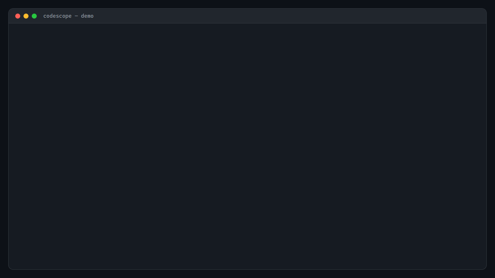

<div align="center">

# Codescope

**The brain your AI coding assistant is missing.**

A graph-first code intelligence engine. Your agents stop reading files and start traversing a knowledge graph — 98-99% fewer tokens, deterministic, single-digit-millisecond traversal.

Rust-native · Fully local · 32 MCP tools · LSP bridge · 57 languages

[Install](#install) · [Why Graph-First?](#why-graph-first) · [Benchmarks](#benchmarks) · [Docs](docs/) · [Release Notes](https://github.com/onur-gokyildiz-bhi/codescope/releases)



</div>

---

## Why This Exists

AI coding assistants are stuck in 2023's playbook: embed every file as a vector, nearest-neighbor a chunk, pray it's relevant. When you ask *"if I change `User::email`, what breaks?"* — they read 40 files and burn 150,000 tokens guessing.

That's not a code intelligence problem. That's an **architecture** problem. Vectors can't do graph traversal. Fuzzy search can't tell you who calls whom.

Codescope solves it the right way: we parse your code into a **knowledge graph** — functions, calls, imports, type hierarchies, decisions, all of it — and let agents **walk the graph** instead of flipping through files.

```
Question: "Who calls parse_config transitively within 3 hops?"

Traditional RAG:        Codescope:
─────────────────       ─────────────────
~150K tokens            ~1-2K tokens
~12 seconds             ~3 ms (end-to-end)
Fuzzy text match        Deterministic edge walk
Guess confidence        Actual answer
```

---

## The 60-Second Pitch

```bash
# 1. Install (one command)
curl -fsSL https://raw.githubusercontent.com/onur-gokyildiz-bhi/codescope/main/install.sh | bash

# 2. In your project
cd your-project
codescope init

# That's it.
# Claude Code, Cursor, Codex, or any MCP-compatible agent now has
# 32 codebase tools wired up automatically.
```

Your agent can now:
- **`search(mode="neighborhood", query="parse_config")`** — callers, callees, siblings, file context, in one call
- **`impact_analysis("User::email", depth=3)`** — transitive blast radius in ~3 ms end-to-end (see [BENCHMARKS.md](BENCHMARKS.md#graph-first-multi-hop-traversal-the-differentiator))
- **`knowledge(action="search", query="status:done")`** — remember what was already shipped across sessions
- **`code_health(mode="hotspots")`** — high-churn + high-complexity code combined in one query
- **`refactor(action="safe_delete", name="foo")`** — check if a function has zero callers before removing it

---

## Why Graph-First?

Most AI code tools (Cursor, Windsurf, Continue) index by embedding every file as vectors. That's **embeddings-first**. It's fine for "find something that *means* X" but catastrophic for questions like:

- *"What functions transitively depend on `parse_config`?"*
- *"If I change `User::email`, what tests break?"*
- *"Show me the full call graph 3 hops out from `main`."*
- *"Who implements this trait?"*

These are **graph traversal questions**. Vector search gives you fuzzy matches. Codescope gives you an exact answer by walking indexed edges.

```
  EMBEDDINGS-FIRST                 GRAPH-FIRST (codescope)
  ─────────────────                ─────────────────────────
  parse → embed → vector DB        parse → entities + edges → SurrealDB
                                                              + embeddings (fallback)
  query: nearest neighbor          query: traverse edges + (optional) NN
  best at: semantic similarity     best at: structural reasoning
  blind to: call relationships     sees: who calls whom, blast radius,
           type hierarchies                type hierarchies, dependencies
```

Embeddings stay as a **secondary index** for natural-language queries where structure doesn't help. But the **primary index is the graph** — the same way developers actually walk through code.

---

## Install

| Platform | Command |
|----------|---------|
| **Linux / macOS (ARM64)** | `curl -fsSL https://raw.githubusercontent.com/onur-gokyildiz-bhi/codescope/main/install.sh \| bash` |
| **Windows** | `irm https://raw.githubusercontent.com/onur-gokyildiz-bhi/codescope/main/install.ps1 \| iex` |
| **Build from source** | `cargo install --git https://github.com/onur-gokyildiz-bhi/codescope` |

**Already installed?** `codescope --version` to check. Update with the same install command.

Pre-built binaries for:
- `x86_64-unknown-linux-gnu`
- `aarch64-unknown-linux-gnu` (NVIDIA DGX Spark, Apple Silicon via Rosetta, Graviton)
- `aarch64-apple-darwin` (Apple Silicon native)
- `x86_64-pc-windows-msvc`

---

## Quick Start

### Option 1 — MCP mode (default, works with Claude Code)

```bash
cd your-project
codescope init
# Creates .mcp.json + indexes your code. That's it.
# Restart Claude Code / Cursor / Zed / Codex — codescope is now available.
```

### Option 2 — Daemon mode (MCP + Web UI in one process)

```bash
codescope init --daemon          # port 9877
# Web UI: http://localhost:9877/
# MCP:    http://localhost:9877/mcp
# Solves all DB lock conflicts. One process serves everything.
```

### Option 3 — LSP mode (any editor with LSP support)

Add codescope as an LSP server in your editor (VS Code, Zed, Neovim, Helix, IntelliJ):

```bash
codescope lsp
# or: codescope-lsp (standalone binary)
```

Your editor's **Go to Definition**, **Find References**, **Hover**, and **Workspace Symbols** are now graph-backed. Single-digit-millisecond response. No extension needed.

### Manual commands (for scripting)

```bash
codescope index .                       # Index current project
codescope search "parse" --mode fuzzy   # Find functions
codescope stats                         # Graph overview
codescope review main..HEAD             # Impact analysis of a PR
codescope migrate                       # Upgrade DB schema
codescope web . --host 0.0.0.0          # 3D web UI, LAN accessible
```

---

## 32 MCP Tools in 9 Categories

<table>
<tr><td width="50%" valign="top">

**Code Search & Navigation**
- `search(mode)` — fuzzy / exact / file / cross_type / neighborhood / backlinks
- `find_callers` / `find_callees` — 1-hop call graph
- `impact_analysis` — transitive BFS blast radius
- `type_hierarchy` — inheritance chains
- `context_bundle` — file overview with delta-mode caching

**Code Quality**
- `lint(mode)` — dead_code / smells / custom SurrealQL rules
- `refactor(action)` — rename / find_unused / safe_delete
- `edit_preflight` — check edit against team patterns

</td><td width="50%" valign="top">

**Knowledge Management (cross-session, cross-agent)**
- `knowledge(action)` — save / search / link / lint
- `knowledge` scopes: `project` / `global` / `both`
- `memory(action)` — save / search / pin
- `capture_insight` — record decisions in real-time
- `manage_adr` — Architecture Decision Records

**Git & Temporal**
- `code_health(mode)` — hotspots / churn / coupling / review_diff
- `sync_git_history` — pipe git log into the graph
- `contributors(mode)` — map / reviewers / patterns
- `conversations(action)` — index / search / timeline

</td></tr>
<tr><td valign="top">

**Semantic Search**
- `semantic_search` — embedding-based, for natural language
- `ask` — decomposes questions into structured queries
- `embed_functions` — generate embeddings on demand

**HTTP / API Analysis**
- `http_analysis(mode)` — calls / endpoint_callers

</td><td valign="top">

**Skills / Project**
- `skills(action)` — index / traverse / generate
- `project(action)` — init / list
- `index_codebase` — full or incremental
- `export_obsidian` — export as wiki
- `retrieve_archived` — fetch large tool outputs

</td></tr>
</table>

Plus: `raw_query` (escape hatch), `graph_stats`, `supported_languages`, `suggest_structure`, `community_detection`, `api_changelog`.

---

## What Makes Codescope Different

### 1. Graph-first, not embeddings-first
Most competitors are vector databases wearing a codebase hat. Codescope is a **knowledge graph** with embeddings as a secondary index.

### 2. Token efficiency that shows on the bill
Measured across 7 projects in 5 languages. Savings range **98.5–99.9%** depending on query type and repo. Sample rows (from [BENCHMARKS.md](BENCHMARKS.md#token-savings-vs-traditional-approach)):

| Question | Repo | Traditional | Codescope | Saved |
|----------|------|:-----------:|:---------:|:-----:|
| Find function + context | tokio | 125,620 tokens | 1,894 tokens | **98.5%** |
| List all structs | tokio | 1,463,493 tokens | 1,183 tokens | **99.9%** |
| Impact analysis (callers + callees) | ripgrep | 197,615 tokens | 2,252 tokens | **98.9%** |
| Find largest functions | axum | 415,438 tokens | 292 tokens | **99.9%** |

[Full per-repo tables and methodology →](BENCHMARKS.md)

### 3. Delta-mode context bundling
Second call to `context_bundle` on the same file returns only the structural diff — not the whole map. 97% token savings on repeat visits.

### 4. File watcher auto re-index
Drop into your editor, write code, the graph updates in the background. No manual re-index. Debounced 2s batches. Hash-checked skip.

### 5. Multi-agent memory
Claude Code, Cursor, Codex, Zed — all agents connected to codescope see the same memory. Decisions captured by one persist for the next.

```
┌─────────────┐  ┌─────────────┐  ┌─────────────┐
│ Claude Code │  │   Cursor    │  │  Codex CLI  │
└──────┬──────┘  └──────┬──────┘  └──────┬──────┘
       │                │                │
       └────────────────┼────────────────┘
                        │
                ┌───────▼────────┐
                │ Codescope MCP  │
                │  (32 tools)    │
                └───────┬────────┘
                        │
                ┌───────▼────────┐
                │   SurrealDB    │
                │ Code entities  │
                │ Call graphs    │
                │ Decisions      │
                │ Embeddings     │
                └────────────────┘
```

### 6. CUDA / GPU-aware
First code intelligence tool to understand `__global__`, `__device__` qualifiers and kernel launch sites (`kernel<<<grid, block>>>`). If you're building GPU code, codescope actually knows what you're doing.

### 7. One-command install, zero external services
No SaaS. No API keys. No cloud. Binary installs, indexes locally, serves locally. Works offline.

---

## Supported Languages

**47 programming languages via tree-sitter:**
TypeScript · JavaScript · Python · **Rust** · Go · Java · C · C++ · C# · CUDA (`__global__` / `__device__` / kernel launches) · Ruby · PHP · Swift · Dart · Kotlin · Scala · Lua · Zig · Elixir · Haskell · OCaml · HTML · Julia · Bash · R · CSS · Erlang · Objective-C · HCL/Terraform · Nix · CMake · Makefile · Verilog · Fortran · GLSL · GraphQL · D · Solidity · GDScript · Elm · Groovy · Pascal · Ada · Common Lisp · Scheme · Racket · XML/SVG · Protobuf

**10 content formats via custom parsers:**
JSON · YAML · TOML · Markdown · Dockerfile · SQL · Terraform · OpenAPI · Gradle · Protobuf · .env

---

## Benchmarks

Re-benchmarked 2026-04-10 on 4 real repositories (Windows 11, Rust 1.91.1, SurrealDB embedded, bench tool with single-row inserts):

| Project | Language | Files | Entities | Relations | Index | DB size |
|---------|----------|------:|---------:|----------:|------:|--------:|
| ripgrep | Rust | 142   | 4,623    | 16,535    | 36.9s | 22.2 MB |
| axum    | Rust | 410   | 5,278    | 15,068    | 37.2s | 22.5 MB |
| tokio   | Rust | 812   | 13,600   | 44,675    | 141.8s | 63.8 MB |
| Gin     | Go   | 109   | 2,400    | 11,324    | 25.1s | 11.5 MB |

> The bench tool uses single-row inserts as a worst-case baseline. The production MCP server pipeline batches inserts and runs materially faster on the same corpora.

Token-savings measurements also cover **FastAPI (Python), Zod (TypeScript), and Express.js (JavaScript)** from an earlier bench run — those per-repo tables are preserved in [BENCHMARKS.md](BENCHMARKS.md#token-savings-vs-traditional-approach) but have not been re-run under the current indexer.

**Multi-hop traversal (end-to-end via `impact_analysis`):** 1.06–3.26 ms across the four re-benchmarked repos (up to 44.7k edges). The minimal traversal primitive (`.name` only) runs 0.63–1.49 ms per hop. Graph traversal scales with edge fan-out at the target, not corpus size.

Full per-repo tables, competitive comparison, and methodology: [BENCHMARKS.md](BENCHMARKS.md)

---

## What Codescope Is (and Isn't)

**Codescope is not an editor. Not an agent. Not a SaaS.**

It's a **context layer** — the brain behind whatever AI coding tool you already use. Claude Code, Cursor, Codex, Zed, VS Code, Neovim — plug codescope in via MCP or LSP and they all get the same graph-backed memory.

```
┌──────────────────────────────────────────────────────┐
│   Editor / Agent (Claude Code, Cursor, Zed, ...)     │  ← you pick this
├──────────────────────────────────────────────────────┤
│   Context layer                                      │
│   ┌──────────────────────┐   ┌──────────────────────┐│
│   │ Built-in (embeddings)│   │ Codescope (graph)    ││  ← you can swap this
│   └──────────────────────┘   └──────────────────────┘│
├──────────────────────────────────────────────────────┤
│   Your code                                          │
└──────────────────────────────────────────────────────┘
```

So "vs Cursor" is the wrong framing. **Codescope vs Cursor's built-in embeddings RAG** is the right one.

### vs built-in context engines

| | **Codescope** | Cursor built-in | Windsurf built-in | Continue.dev | Claude Code skills |
|---|:---:|:---:|:---:|:---:|:---:|
| Architecture | **Graph-first** | Embeddings | Embeddings | Embeddings | File-reading |
| Call graph traversal | **Native, single-digit ms** | ❌ | ❌ | ❌ | Read-based |
| Impact analysis (N-hop) | **Native** | ❌ | ❌ | ❌ | ❌ |
| Type hierarchy queries | **Native** | ❌ | ❌ | ❌ | ❌ |
| Cross-session memory | **Shared across agents** | Per-editor | ❌ | ❌ | Per-project files |
| Editor/agent lock-in | **None — MCP + LSP** | Cursor only | Windsurf only | Continue only | Claude only |
| Fully local | **Yes** | ❌ (cloud indexing) | ❌ (cloud) | Yes | Yes |
| CUDA/GPU code-aware | **Yes** | ❌ | ❌ | ❌ | ❌ |
| Cost | **Free (MIT)** | Bundled (cloud tier) | Bundled (cloud tier) | Free | Bundled |

### vs dedicated code intelligence backends

| | **Codescope** | Sourcegraph | Greptile | Aider's repomap |
|---|:---:|:---:|:---:|:---:|
| Graph database | SurrealDB (embedded) | SCIP (partial graph) | Cloud graph | ❌ (flat map) |
| MCP protocol | **32 tools** | ❌ | API only | ❌ |
| LSP bridge | **Yes, graph-backed** | Yes (per-language) | ❌ | ❌ |
| AI agent memory | **Yes, cross-session** | ❌ | ❌ | ❌ |
| Self-hosted | **Yes** | Paid tier | ❌ (SaaS) | Yes |
| Cost | **Free (MIT)** | $$$ | SaaS pricing | Free |

**The honest positioning:** if you already love Cursor or Claude Code, don't switch. Add codescope as a second brain. If you're building your own agent, codescope handles context so you don't have to.

---

## Architecture

```
Your Code
    ↓
tree-sitter parsers (47 langs + 10 formats)
    ↓
SurrealDB knowledge graph
    │
    ├── Entities: function, class, file, import, package, config, doc, infra, knowledge
    ├── Relations: calls, contains, imports, implements, inherits, supports,
    │              contradicts, related_to, launches (CUDA kernels)
    └── Secondary: fastembed-rs vector embeddings for semantic_search
    ↓
3 interfaces:
    ├── MCP (stdio or HTTP daemon) ─── Claude Code, Cursor, Codex, Zed
    ├── LSP (stdio)                 ─── VS Code, Neovim, Helix, IntelliJ
    └── Web UI (HTTP port 9876/9877) ── 3D graph, Obsidian-like navigation
```

---

## Roadmap

**Recently shipped (v0.7.0 → v0.7.6):**
- ✅ Knowledge graph visualization (3D web UI)
- ✅ Delta-mode context bundling (97% token save on repeats)
- ✅ Graph-ranked search (caller-count PPR)
- ✅ Multi-edge impact analysis (calls + imports + implements)
- ✅ File watcher auto re-index
- ✅ Daemon mode (single process for MCP + Web UI)
- ✅ Tool consolidation (57 → 32, -44%)
- ✅ CUDA / GPU code semantic support
- ✅ LSP bridge (any editor)
- ✅ Schema migration system
- ✅ Cross-project shared knowledge graph
- ✅ Diff-aware PR review (`codescope review main..HEAD`)

**Next (v0.8.x):**
- 🔜 VSCode extension (built on LSP)
- 🔜 Continuous Obsidian/Notion sync
- 🔜 Opt-in telemetry (drop unused tools based on real usage)
- 🔜 Windows MSI installer

[Full roadmap in the knowledge graph](https://github.com/onur-gokyildiz-bhi/codescope/tree/main/docs) — `knowledge(action="search", query="status:planned")` when connected.

---

## Documentation

- [Quickstart](docs/quickstart.md) — step-by-step walkthrough
- [LLM Usage Guide](docs/llm-usage-guide.md) — tool selection patterns for AI agents
- [Troubleshooting](docs/troubleshooting.md) — common issues + fixes
- [Benchmarks](BENCHMARKS.md) — methodology and numbers
- [Contributing](CONTRIBUTING.md) — dev setup, test conventions
- [Architecture deep-dive](ARCHITECTURE.md) — graph schema and internals
- [Security](SECURITY.md) — threat model and disclosure policy

---

## Configuration

| Setting | Default | Override |
|---------|---------|----------|
| DB path | `~/.codescope/db/<repo>/` | `--db-path` or `CODESCOPE_DB_PATH` |
| Web UI port | `9876` | `--port` |
| Daemon port | `9877` | `--port` |
| Embeddings | FastEmbed (local) | `--provider ollama\|openai` |
| Log level | `info` | `RUST_LOG=debug` |

---

## Observability

Codescope can export OpenTelemetry traces over OTLP for MCP tool invocations,
graph queries, and cache-hit counters. Useful for spotting slow tools and
tracking cache effectiveness.

Set `CODESCOPE_OTLP_ENDPOINT` to enable export:

```bash
export CODESCOPE_OTLP_ENDPOINT=http://localhost:4317
codescope mcp .
```

When the env var is unset (the default), telemetry is a strict no-op —
zero overhead and zero network connections. Tested with Jaeger,
Grafana Tempo, and Honeycomb.

---

## Contributing

Contributions welcome. See [CONTRIBUTING.md](CONTRIBUTING.md) for dev setup.

```bash
cargo test --workspace          # All tests
cargo clippy -- -D warnings     # Lint (strict)
cargo run -p codescope-bench    # Benchmarks
cargo fmt --all                 # Format (required before commit)
```

CI auto-formats on push to main. You still should run `cargo fmt --all` locally.

---

## Credits

- **Graph traversal:** SurrealDB
- **Parsing:** tree-sitter + its 47 language grammars
- **Embeddings:** FastEmbed-rs
- **MCP protocol:** rmcp
- **LSP server:** tower-lsp
- **3D visualization:** Three.js + 3d-force-graph + SolidJS

Inspired by:
- [Karpathy's LLM Wiki pattern](https://gist.github.com/karpathy/442a6bf555914893e9891c11519de94f) — the wiki IS the product
- [Graph of Skills (ICLR 2026)](https://github.com/davidliuk/graph-of-skills) — PPR over typed edges
- [Relational Transformer (ICLR 2026)](https://github.com/snap-stanford/relational-transformer) — structure as attention mask

---

## License

MIT — [Onur Gokyildiz](https://github.com/onur-gokyildiz-bhi)

<div align="center">

**If codescope saves you an afternoon of context-switching, [star the repo](https://github.com/onur-gokyildiz-bhi/codescope). That's what keeps this project going.**

</div>
